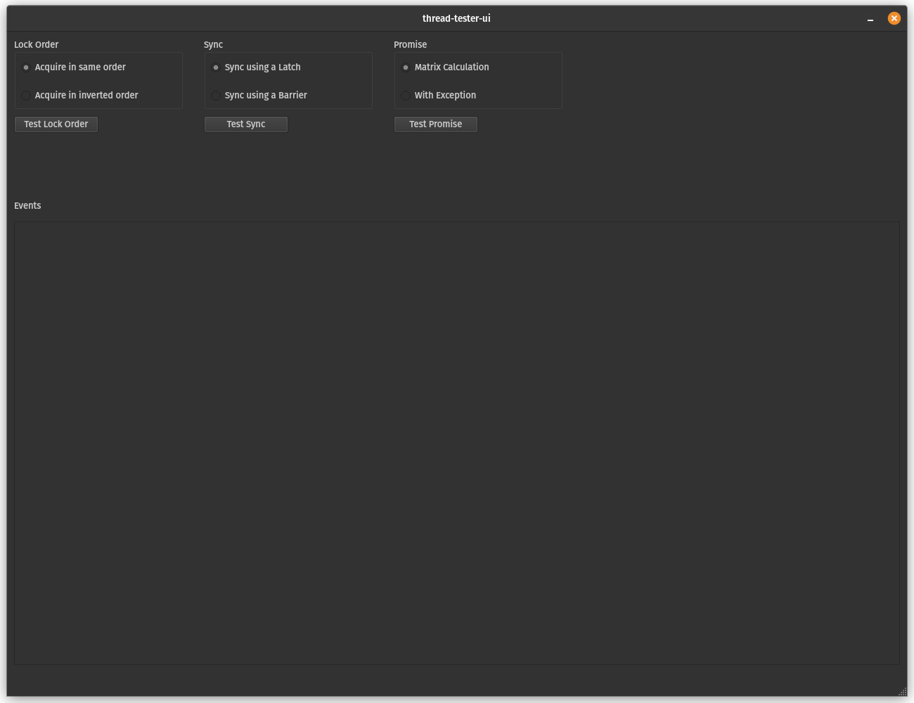

# thread-tester-ui

## Description

This UI works in conjunction with 2 different thread tester engines: 

[Thread Testing Engine](https://github.com/TallDave67/thread-tester-engine)

[Thread Testing Engine - Promises](https://github.com/TallDave67/thread-tester-engine-promises)

On your local machine please create a brother folder to thread-tester-ui called thread-tester-ui-engines, and copy into it the 2 executables produced by the above two engine repos.

## UI

